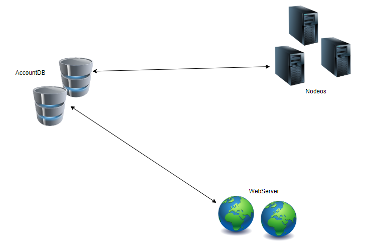

## 交易行的设计（法币）
----
**难点**
* 在不接支付宝等第三方平台API的情况下，如何处理作弊问题？
* 如何保证交易的可信性

**解决方案探讨**
1. 第一个方案
   

1. 让承兑商提供第三方兑换功能，系统分支进行监控….

## 开发计划

主网站 = {数据库管理网站、历史币价采集网站、 网页提供网站（用户接口）、区块链交互端网站}

## union官网与区块链的交互

在EOS系统中，最主要的是Nodeos，Cleos 与 Keosd都是辅助功能。在Union系统中，AccountDB其实相当于同时充当了Cleos与Keosd的功能。AccountDB、Nodeos、Webserver的关系如下图所示： 

AccountDB储存了大量用户的私钥信息，所以私钥不适合进行网络传输，而应该直接在本地进行签名。所以，交易的流程大概是这样的： 用户登录WebServer，填写交易信息，交易推送到AccountDB进行签名，此时如果用户的登录信息正确，则找到正确的私钥进行签名。AccountDB再调用Nodeos的RPC Api接口，将数据写入到区块链上。

目前暂时只提供这一条线吧，考虑再三，还是要把WebServer的代码用javascript，为了方便以后的扩展。因为理论上，用户也可以直接保存自己的私钥信息，而不是借助AccountDB。也就是说应该有一条线是WebServer直接与Nodeos交互的，但这是以后再扩展的工作了。

### Account DataBase 

数据库服务部分是由多台主机构成，当然不会比webserver的主机多。每台主机都运行数据库服务，同时也有一个wrap，实现connector功能，还实现与webserver的交互。这个数据库主要保存了账号的私钥部分，当然保存方式是把私钥截断，并与很多无效数据进行混淆。只有webserver提供了可靠的信息，才能从浩如烟海的数据堆中拼凑出正确的私钥。因此，对Account Database的攻击是无效的。

AccountDB集成了Nodeos的RPC Api，也就是在AccountDB里直接会进行交易签名，然后对Nodeos进行远程调用，目前采用的是nodejs，也就是采用官方的SDK， eosjs。

### WebServer
用户登录到webserver后，要想使用钱包转账等功能，会被要求提供另一个账号和密码，该密码是在Account DataBase中找到正确信息的关键。一般的，webserver的常规数据库根据用户账号密码会保存一部分的Account Database中的私钥获取线索。另一部分需要用户输入。

例如，用户输入信息串 S + var  得到的结果hash得到了Account Database中的数据地址，当用户变更S时，可以任意的改变var而得到一个从没被使用过的新位置存放私钥。这就避免了直接用S表示私钥位置的尴尬，因为用户变更S到新值时很可能那个位置已经被别人占用了。当然，私钥很可能是被截断保存的，采用类似的方法可以做到，这里不再具体赘述。

从安全的角度，网络传输可以使用非对称加密，从而保证网络传输过程中的信息安全。只有在上述网络的节点本机上，密钥才可能会被从内存截获。但在保证相关各个环节主机可靠性的基础上，信息的安全性是得到保证的。即使某个节点被完全攻破，数据外泄，也不会产生财务安全问题，除非那些节点在网络上实时的运行时遭受‘监控’才会产生安全问题，但也只是局部的安全问题。

